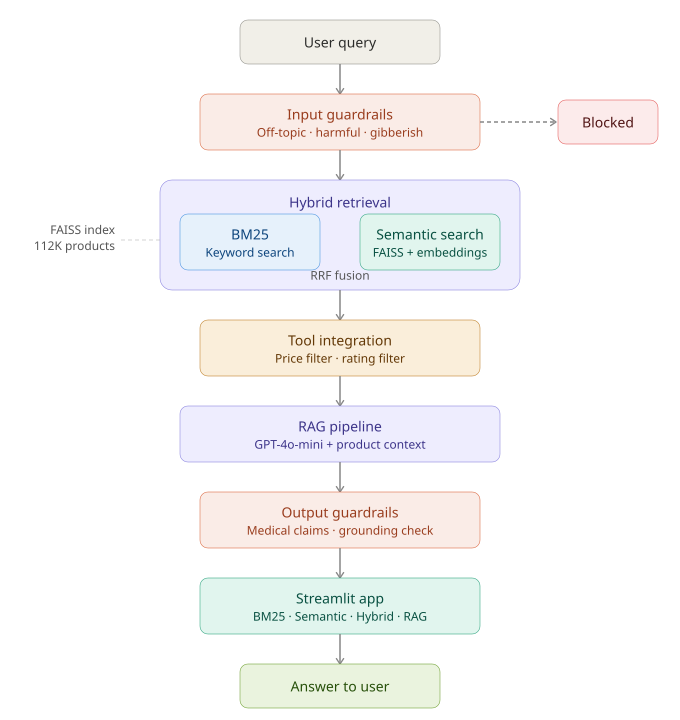
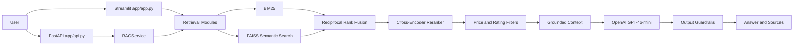

# Amazon Product Query Assistant

It combines BM25 keyword search, FAISS semantic retrieval, Reciprocal Rank Fusion, cross-encoder reranking, grounded GPT answers, source citations, guardrails, evaluation, Streamlit exploration, and a FastAPI service.



## Dataset

The local processed artifacts were built from Amazon Reviews 2023 All Beauty:

- Products: 112,590
- Reviews: 701,528
- Runtime artifacts: `products.jsonl`, `bm25_index.pkl`, `tokenized_corpus.pkl`, `faiss.index`, `embeddings.npy`


## Architecture



## Retrieval Pipeline

1. Load processed products, BM25 index, FAISS index, and embedding model.
2. Run BM25 keyword retrieval over tokenized product text.
3. Run FAISS semantic retrieval with `all-MiniLM-L6-v2` embeddings.
4. Fuse BM25 and semantic results with Reciprocal Rank Fusion.
5. Return product metadata, BM25/semantic ranks, hybrid score, and hybrid rank.

## Reranking Pipeline

Hybrid candidates are reranked with `cross-encoder/ms-marco-MiniLM-L-6-v2`.

The API returns both:

- `original_hybrid_rank`: rank before cross-encoder reranking.
- `rerank_position`: final rank after reranking.

## RAG Generation Flow

`POST /ask` runs:

1. Pydantic request validation.
2. Input guardrail validation.
3. Hybrid retrieval.
4. Cross-encoder reranking.
5. Price/rating filter detection and application.
6. Prompt construction from retrieved product context only.
7. Grounded OpenAI answer generation with bracket citations.
8. Output guardrail validation.
9. Fallback response when context is weak or LLM generation fails.

Generated answers should only recommend products present in the retrieved context. API responses include source titles, ASINs, scores, ranks, snippets, and latency breakdowns.

## Evaluation

Existing evaluation support is preserved:

- Precision@K
- MRR
- NDCG@K
- RAGAS faithfulness
- RAGAS answer relevancy

Added:

- Hybrid before/after reranking comparison.
- JSON output at `results/evaluation_metrics.json`.

Example:

```python
from src.retrieval_metrics import evaluate_with_reranking

metrics = evaluate_with_reranking(
    bm25=bm25,
    index=index,
    products=products,
    ground_truth=ground_truth,
    model=embedding_model,
    reranker_model=reranker_model,
    k=5,
)
```

Existing reported retrieval metrics:

| Method | Precision@5 | MRR | NDCG@5 |
|---|---:|---:|---:|
| BM25 | 0.60 | 0.75 | 0.60 |
| Semantic | 0.66 | 0.83 | 0.69 |
| Hybrid | 0.78 | 0.73 | 0.71 |

Existing RAGAS results:

| Metric | Score |
|---|---:|
| Faithfulness | 0.57 |
| Answer relevancy | 0.60 |

## Project Structure

```text
app/
  api.py                # FastAPI service
  schemas.py            # Pydantic contracts
  app.py                # Streamlit demo
api/
  app.py                # Compatibility wrapper for app.api
src/
  bm25.py               # BM25 build/load/search
  semantic.py           # FAISS semantic build/load/search
  hybrid.py             # Reciprocal Rank Fusion
  reranker.py           # Cross-encoder reranking
  rag.py                # Grounded generation
  service.py            # API orchestration and metrics
  citations.py          # Source metadata
  guardrails.py         # Input/output validation
  tools.py              # Price/rating filters
  retrieval_metrics.py  # Precision, MRR, NDCG, rerank comparison
  ragas_eval.py         # RAGAS evaluation
tests/
  test_api.py
  test_evaluation.py
  test_reranker.py
  test_retrieval.py
```

## Local Setup

```bash
python -m venv venv
source venv/bin/activate
pip install -r requirements.txt
cp .env.example .env
```

Set `OPENAI_API_KEY` in `.env` for `/ask` generation.

Required processed artifacts:

```text
data/processed/products.jsonl
data/processed/bm25_index.pkl
data/processed/tokenized_corpus.pkl
data/processed/faiss.index
data/processed/embeddings.npy
```

## Run FastAPI

```bash
uvicorn app.api:app --host 0.0.0.0 --port 8000
```

Health:

```bash
curl http://localhost:8000/health
```

Metrics:

```bash
curl http://localhost:8000/metrics
```

## API Examples

Search:

```bash
curl -X POST http://localhost:8000/search \
  -H "Content-Type: application/json" \
  -d '{"query":"best moisturizer for sensitive skin","top_k":3,"mode":"rerank"}'
```

Search response shape:

```json
{
  "query": "best moisturizer for sensitive skin",
  "mode": "rerank",
  "results": [
    {
      "parent_asin": "B000...",
      "title": "Sensitive Skin Moisturizer",
      "hybrid_score": 0.031,
      "original_hybrid_rank": 4,
      "rerank_score": 8.42,
      "rerank_position": 1,
      "snippet": "Review or product text snippet..."
    }
  ],
  "retrieval_latency_ms": 42.3,
  "reranking_latency_ms": 18.7,
  "latency_ms": 61.4
}
```

Ask:

```bash
curl -X POST http://localhost:8000/ask \
  -H "Content-Type: application/json" \
  -d '{"query":"best moisturizer for sensitive skin under $30","top_k":3}'
```

Ask response shape:

```json
{
  "response": "A good option is Sensitive Skin Moisturizer because ... [1]",
  "sources": [
    {
      "parent_asin": "B000...",
      "title": "Sensitive Skin Moisturizer",
      "original_hybrid_rank": 2,
      "rerank_position": 1,
      "rerank_score": 7.91,
      "snippet": "Review or product text snippet..."
    }
  ],
  "retrieved": [
    {
      "parent_asin": "B000...",
      "title": "Sensitive Skin Moisturizer",
      "original_hybrid_rank": 2,
      "rerank_position": 1,
      "rerank_score": 7.91,
      "snippet": "Review or product text snippet..."
    }
  ],
  "filters": {"max_price": 30.0},
  "citations": [{"id": 1, "parent_asin": "B000...", "title": "Sensitive Skin Moisturizer"}],
  "guardrail_decision": "allowed",
  "retrieval_latency_ms": 44.1,
  "reranking_latency_ms": 19.5,
  "generation_latency_ms": 812.4,
  "latency_ms": 876.0
}
```

## Run Streamlit

```bash
streamlit run app/app.py
```

## Run Tests

```bash
pytest -q
```

Current tests cover retrieval metrics, guardrails, tools, reranking metadata, evaluation output, API endpoints, and Pydantic schema validation.

## Docker

Build:

```bash
docker build -t amazon-product-rag .
```

Run with processed artifacts mounted:

```bash
docker run --env-file .env \
  -p 8000:8000 \
  -v "$PWD/data/processed:/app/data/processed:ro" \
  amazon-product-rag
```

The container runs `uvicorn app.api:app`. Logs are written to `logs/retrieval.log` in the container filesystem unless a log volume is mounted.

## Logging

The API logs query text, retrieval mode, guardrail decision, result count, and latency metrics. It does not log API keys. Runtime logs are ignored by git.
