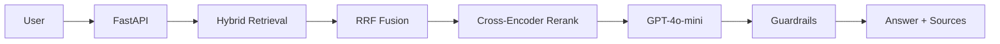

# Amazon Product Query Assistant

A hybrid search + RAG system for product discovery, combining BM25 keyword search, FAISS semantic retrieval, cross-encoder reranking, and grounded GPT-4o-mini answers with citations.


## Dataset
Built on Amazon Reviews 2023 (All Beauty category): **112,590 products**, **701,528 reviews**.

## How It Works
1. **Hybrid Retrieval** — BM25 (keyword) + FAISS semantic search (`all-MiniLM-L6-v2`), fused via Reciprocal Rank Fusion.
2. **Reranking** — Candidates reordered using `cross-encoder/ms-marco-MiniLM-L-6-v2`.
3. **Grounded Generation** — GPT-4o-mini answers strictly from retrieved context, with bracket citations and price/rating filters.
4. **Guardrails** — Input/output validation with fallback responses when context is weak.



## Results

| Method | Precision@5 | MRR | NDCG@5 |
|---|---:|---:|---:|
| BM25 | 0.60 | 0.75 | 0.60 |
| Semantic | 0.66 | 0.83 | 0.69 |
| Hybrid | 0.78 | 0.73 | 0.71 |

RAGAS: Faithfulness 0.57 · Answer Relevancy 0.60

## Stack
FastAPI · Streamlit · BM25 (rank-bm25) · FAISS · Sentence Transformers · OpenAI GPT-4o-mini · Docker · GitHub Actions CI/CD · Pytest (22 tests)

## Run It

```bash
python -m venv venv && source venv/bin/activate
pip install -r requirements.txt
cp .env.example .env   # set OPENAI_API_KEY

uvicorn app.api:app --host 0.0.0.0 --port 8000   # API
streamlit run app/app.py                          # Streamlit demo
pytest -q                                          # tests
```

Or with Docker:
```bash
docker build -t amazon-product-rag .
docker run --env-file .env -p 8000:8000 \
  -v "$PWD/data/processed:/app/data/processed:ro" amazon-product-rag
```
